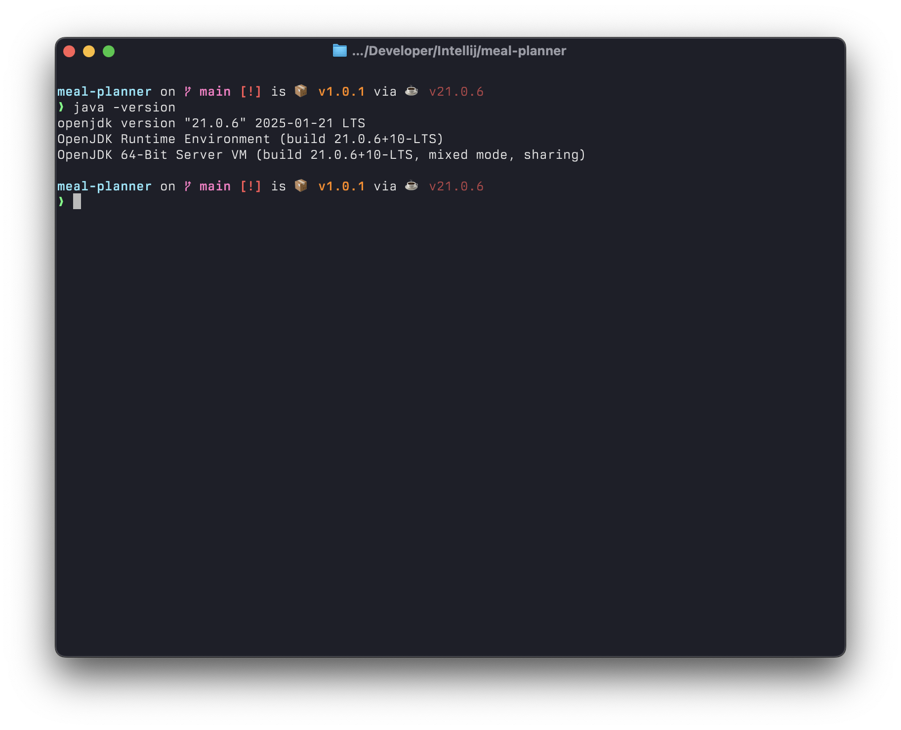
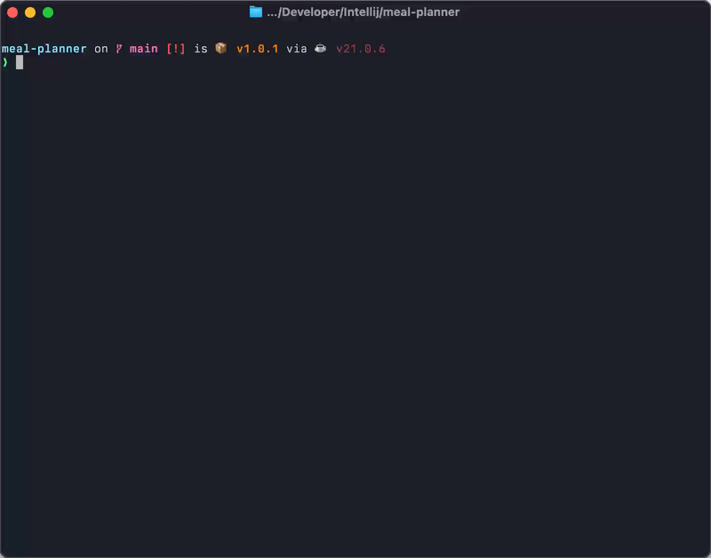
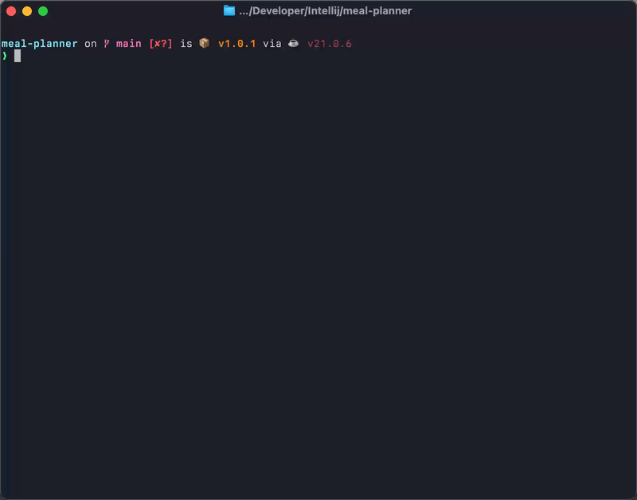

## Project description

This project is a Meal Planning application developed as a part of the IDATG1003 course.
The application allows users to create, track, remove both Recipes and Ingredients.
The goal of this project was to help achieve the UN's sustainability goal by reducing food waste.

## Project structure

```
mealplanner
├── Launcher.java
├── user
│   ├── Printable.java
│   ├── User.java
│   ├── inventory
│   │   ├── Ingredient.java
│   │   ├── IngredientStorage.java
│   │   ├── InventoryManager.java
│   │   └── Measurement.java
│   └── recipe
│       ├── CookBook.java
│       ├── Recipe.java
│       ├── RecipeBuilder.java
│       ├── RecipeManager.java
│       └── Step.java
└── util
    ├── AbortException.java
    ├── InputScanner.java
    ├── MealPlanner.java
    ├── OutputHandler.java
    ├── Utility.java
    ├── command
    │   ├── AddCommand.java
    │   ├── ClearCommand.java
    │   ├── Command.java
    │   ├── CommandRegistry.java
    │   ├── ExitCommand.java
    │   ├── FindCommand.java
    │   ├── GoCommand.java
    │   ├── HelpCommand.java
    │   ├── IllegalCommandCombinationException.java
    │   ├── ListCommand.java
    │   ├── RemoveCommand.java
    │   ├── StatsCommand.java
    │   ├── UnknownCommand.java
    │   └── ValidCommand.java
    ├── input
    │   ├── CommandInput.java
    │   └── UnitInput.java
    └── unit
        ├── UnitConverter.java
        ├── UnitRegistry.java
        └── ValidUnit.java

8 directories, 36 files
```

Project source code is divided into two parts, package `user` && `util`.

* In the package `user` you can find all the relevant classes that have dependency on the `User` class.
* In the package `util` you can find all the application's helper class and command
  layer.

## How to run the project

This project requires [JDK 21](https://whichjdk.com/) to be installed on the system.


Before running any commands, check if the correct JDK version is installed on the system by typing:

```bash
java --version
```



If everything looks good, we can move on to build the project from source.

The `main()` method is called from the class `Launcher`,
where it creates a `new Application` and invoke the `run()` method.

1. Go to the project directory.

```bash
cd <project-root>
```

2. Run the following command in the terminal to build and run the project.

```bash
./mvnw -q
```

## How to run the tests



When using `mvn install` Maven already automatically ran all the test files before building from source.
However, if one wishes to only run the test files,
Maven allows simply running

```bash
./mvnw test
```

in the terminal while in the project root directory,
and it will run all the test files within the project.

## References

### Builder design pattern

[](https://refactoring.guru/design-patterns/builder)

The Builder pattern allows for a flexible solution for scenarios involving multiple steps and varied components,
such as recipe creation.
[Refactoring Guru](https://refactoring.guru/design-patterns/builder)

### Command design pattern

[](https://refactoring.guru/design-patterns/command)

Command design pattern helped me to fully understand the inheritance,
abstract classes, and methods which are the core of this project.
[Refactoring Guru](https://refactoring.guru/design-patterns/command)
